# Transcription and captions

OpenScreen turns recorded audio into on-device text, and renders that text as
captions over both the preview and the export. The recogniser runs natively on
the desktop — no network calls, no Python — and feeds a single transcript per
asset into a caption layer that derives its cues on every render. Code lives
in `electron/stt/` (main-process STT pipeline), `electron/native/whisper-stt/`
(the C++ helper that links whisper.cpp directly), and
`src/lib/ai-edition/captions/` (the caption layer that derives its cues from
the transcript).

## Pipeline

```mermaid
flowchart LR
    Z["Asset added<br/>(import or recording)"] -- "sync()" --> Y["transcriptionStore queue<br/>(src/lib/ai-edition/store/transcriptionStore.ts)"]
    Y -- "one job at a time" --> A["Recorded audio"]
    A -- "extract mono 16 kHz" --> B["transcribeAsset<br/>(src/lib/ai-edition/document/transcribe.ts)"]
    B -- "IPC: Float32Array + language" --> C["SttManager<br/>(electron/stt/index.ts)"]
    C -- "POST /inference (WAV)" --> D["whisper-stt-server<br/>(electron/native/whisper-stt/)"]
    D -- "whisper_full() + DTW" --> E["SttTranscribeResponse<br/>(segments + wordSegments)"]
    E --> C
    C -- "IPC return" --> B
    B --> F["AxcutTranscript<br/>on document.transcripts[]"]
    F --> G["deriveCaptionCues<br/>(src/lib/ai-edition/captions/cues.ts)"]
    G -- "CaptionCue[]<br/>(virtual ms)" --> H["captionCuesToTextRegions<br/>(synthetic text regions)"]
    H -- "annotation path<br/>(scene description)" --> I["Native compositor<br/>(preview AND export)"]
```



The renderer pieces — `transcribeMono16kToSegments`
(`src/lib/captioning/transcribe.ts`) called from `transcribeAsset`
(`src/lib/ai-edition/document/transcribe.ts`) — are a thin IPC adapter: the
audio crosses to the main process, the helper does the recognition, and the
result is mapped back onto the `AxcutTranscript` shape the rest of the editor
reads. From the moment that transcript is persisted, captions and the words
they show cannot drift — captions are a derived view, not a parallel store.

## Auto-transcription

Recognition is local and free, so the editor does not wait to be asked: every
asset in the document gets a transcript on its own. The queue lives in
[`src/lib/ai-edition/store/transcriptionStore.ts`](../../src/lib/ai-edition/store/transcriptionStore.ts),
mounted once by the shell through `useAutoTranscription()`, and it is the only
thing that calls `transcribeAsset`.

Why it exists at all: "Smart cuts with AI" (and captions, and the transcript
pane) need a transcript, but nothing produced one until the user found the
Media tab or the transcript pane and pressed a button. The obvious first click
was therefore also the one that could not work. Now the button is either ready,
or it says what it is waiting for.

What the store owns and what it does not:

- **The document owns the transcript.** `document.transcripts[]` is still the
  source of truth for "is there one"; the store only owns the JOB (queued /
  running / failed + the phase for the spinner). `deriveAssetStatus`
  ([`transcription/status.ts`](../../src/lib/ai-edition/transcription/status.ts))
  folds the two into the single status the UI renders, and
  `resolveTranscriptGate` folds a set of those into the ready / pending /
  blocked verdict that enables or disables a transcript-dependent action.
  A stored transcript **outranks a failed job**: a regenerate that dies on a
  whisper restart leaves the previous transcript in place and usable, and
  reading that asset as "failed" would have disabled Smart cuts for the rest of
  the session over a transcript sitting right there.
- **Gates are resolved over the assets the TIMELINE plays**
  (`transcriptRelevantAssetIds`), never over `project.primaryAssetId`. In a
  recording project the primary asset is the screen capture — frequently the
  silent one — so a primary-scoped answer had the transcript and captions panes
  announce "this media has no audio track" for a project whose actual footage
  was mid-transcription. `requestTimelineTranscripts` is the matching action for
  the panes' one button: every timeline asset that still lacks a transcript,
  skipping the ones already known to be silent and waiting on (rather than
  duplicating) a run the background pass already has in flight.
- **One run at a time.** whisper-server is a single process and the audio
  extraction path holds decoded frames in renderer memory, so the pump is a
  sequential loop, not a fan-out.
- **The auto pass never loops.** `sync` enqueues an asset only when it has no
  transcript, no job entry (queued / running / failed alike) and no persisted
  failure, and a job is deleted only after the save that carries its transcript
  has resolved. Since `sync` runs on every document change — including the one
  the run itself produces — that guard is what keeps it from re-triggering.
- **Silence is remembered, glitches are not.** A media with no audio track (a
  screen recording captured with no mic and no system audio) fails the same way
  every time, so the verdict is written to `asset.transcriptionFailure` and the
  auto pass skips it on the next load instead of re-extracting its audio to
  rediscover it. Everything else stays in memory for the session and is retried
  on the next load. A successful manual retry clears the stored verdict in the
  same save that writes the transcript.
- **No local engine, no background pass.** Without `window.electronAPI.stt`
  (browser preview, e2e shim) nothing is queued; a manual request still runs.

What each state means in the UI: a spinner and "Transcribing…" while queued or
running, the media-card dot green (ready) / amber (silent or no speech) / red
(failed) via
[`TranscriptionStatus.tsx`](../../src/components/ai-edition/TranscriptionStatus.tsx),
and — the point of the whole thing — a disabled "Smart cuts" entry whose
subtitle is the reason rather than "With AI".

### One phase, including the first-run model download

On a fresh install the GGML model (~574 MB) is not on disk. It is fetched by
`SttManager.prepare()` **inside** the `stt:transcribe` IPC call — i.e. inside a
run this store has already marked `running` — so the user sees one single busy
phase that simply takes longer the first time. That is deliberate: no separate
"downloading" step, no progress bar to stare at, and nothing that looks
clickable in the meantime (`phase: "model"` is emitted by the main process but
deliberately not forwarded to the renderer by `transcribeAsset`). Nothing in the
renderer imposes a timeout that a slow download could trip: the preload does a
bare `ipcRenderer.invoke`, `fetchWithRetry` has no per-request deadline, and
whisper-server's 30 s readiness budget only starts once the download resolved.

Three edges make that promise hold, and each is load-bearing:

- **A failed setup is not cached.** `SttManager.init` used to memoise the
  rejected `prepare()` promise, so one dropped connection during the first
  download failed every later transcription in the session — including the retry
  the editor offers — until the app was restarted. It now clears the slot on
  failure ([`electron/stt/index.ts`](../../electron/stt/index.ts)).
- **A transient failure stops the queue** instead of walking the remaining
  assets into the same wall: they inherit the verdict (one toast, one retry
  affordance) rather than each spending a full retry budget.
- **Read-only is scoped per asset.** The transcript pane's blocks go read-only
  only for the asset whose transcript is being rewritten, and say so (spinner +
  "Transcribing…" + dimmed stream). A timeline-wide flag made every other
  clip's word stream swallow Backspace and hover-bin clicks in silence for the
  whole background pass.

Still synchronous, and still on the main thread: `mixToMono`
([`src/lib/captioning/extractMono16k.ts`](../../src/lib/captioning/extractMono16k.ts))
now hoists its channel arrays out of the sample loop (it was making one WebIDL
call per sample per channel), but a long recording will still block the renderer
for a moment during "extracting-audio". Moving the mixdown to a worker is the
next step if it shows up in practice.

## The STT engine

The recogniser is **whisper.cpp**, embedded as a static library inside one
helper executable per desktop platform. whisper.cpp picks the actual compute
backend at runtime — Metal on Apple Silicon, Vulkan on Windows and Linux, CPU
fallback when no usable GPU or driver is present — so the renderer only knows
which backend the helper bound by reading the response field at
[`electron/stt/transcriptionContract.ts:35`](../../electron/stt/transcriptionContract.ts:35).
There is no OS-side GPU probing; `electron/stt/gpuDetector.ts` resolves the
per-platform binary name only, and the real backend is corrected from the
helper's `/inference` JSON.

Why whisper.cpp, in one paragraph: a single C++ dependency with native DTW
token timestamps for word-level timing, a portable runtime device selection
that covers Metal, Vulkan and CPU in one binary, and self-contained long-form
chunking (`whisper_full()` over recordings longer than 30 s) without manual
windowing on our side. Validation data — backend-by-backend WER and real-time
factors — lives in
[`tools/stt-eval/whispercpp-dtw-poc/REPORT.md`](../../tools/stt-eval/whispercpp-dtw-poc/REPORT.md).

### Per-platform backend

The binary is named `whisper-stt-server` (`.exe` on Windows) on **every**
platform — the backend is a build-time flag, not a file name, and
`binaryNameForBackend`
([`electron/stt/gpuDetector.ts:60`](../../electron/stt/gpuDetector.ts:60))
returns that single name. What varies is which backend was compiled in:

| Platform | Backend compiled in | Runtime device candidates |
|---|---|---|
| macOS arm64 | Metal (`-DOSC_ENABLE_METAL=ON`) | Metal, CPU |
| macOS x64 | CPU only | CPU |
| Windows x64 | Vulkan (`-DOSC_ENABLE_VULKAN=ON`) | Vulkan, CPU |
| Linux x64 | Vulkan (`-DOSC_ENABLE_VULKAN=ON`) | Vulkan, CPU |

whisper.cpp chooses the device in `whisper_backend_init`; the helper reports
what actually bound (via `ggml_backend_dev_name()`) and `SttManager` returns
it verbatim in the response.

> `ggml_backend_dev_name()` returns a *device* name carrying an index —
> `Vulkan0`, `CUDA0`, `MTL0` — not the backend's title. Metal is the trap:
> ggml-metal builds its device name from `GGML_METAL_NAME` (`"MTL"`), so the
> string `"Metal"` appears nowhere in it. `detect_active_backend()` matched
> `"Metal"` and therefore reported `whispercpp-cpu` on every Apple Silicon run
> while the Metal backend was in fact bound. It now matches `MTL` and filters on
> `ggml_backend_dev_type()` being GPU/IGPU, which also drops ggml-blas
> (Accelerate on macOS, device type ACCEL) from consideration.

### Word-level alignment (DTW token timestamps)

1. **Decode** — `whisper_full()` runs with the default sampling parameters
   (`WHISPER_SAMPLING_GREEDY`), returning phrase segments plus a per-token
   array.
2. **DTW timestamp** — every non-special token carries `t_dtw` in
   centiseconds from whisper.cpp's native DTW
   (`dtw_token_timestamps=true`, `dtw_aheads_preset=WHISPER_AHEADS_SMALL`,
   `flash_attn=false`, which together are the prerequisites for DTW to
   actually run). `t_dtw == -1` is the DTW-inactive guardrail: the helper
   fails the request rather than emit zero-quality timestamps.
3. **Word grouping** — BPE tokens join into a single word whenever the
   detokenized text begins with a space, or at the first token of the
   segment.
4. **Word range** — `word.start = t_dtw of the word's first token`, and
   `word.end = t_dtw of the next word's first token` (or the segment's `t1`
   for the segment's last word). The result is a monotonic, gap-free timeline
   of word ranges that downstream code can use without rebasing.
5. **Re-anchor on the audio** — `t_dtw` marks where the decoder *emitted* a
   token, not where the speaker started saying it, so every boundary lands
   80–150 ms late (measured across real recordings; the mean correction on
   the reference clip is 83 ms). Because consecutive words share a boundary,
   the whole transcript is dragged right by roughly a syllable.
   [`electron/stt/snapWordBoundaries.ts`](../../electron/stt/snapWordBoundaries.ts)
   pulls each boundary back to the quietest 10 ms frame in the preceding
   150 ms of the same samples whisper was given. It is self-limiting: on a
   decaying tail — a word ending a phrase, where whisper is already right —
   the quietest frame *is* the reported one and nothing moves. Boundaries
   past the end of the decoded audio are left untouched.

> Why this matters beyond caption timing: the transcript editor turns a word
> selection into a trim of exactly `[firstWord.startSec, lastWord.endSec]`,
> so a late boundary leaves the attack of the first removed word audible and
> bites into the following kept word. `LOOKBACK_SEC` in that module is the
> calibration knob — widen it and boundaries inside continuous speech start
> snapping onto the previous syllable's trough.

The recognition call returns **both** the phrase segments and the per-word
segments in one pass
([`electron/stt/transcriptionContract.ts:17-30`](../../electron/stt/transcriptionContract.ts:17)),
so no second pass is needed.

### Long-form recordings

OpenScreen splits long recordings at nearby low-energy boundaries, transcribes
the bounded chunks sequentially, then restores their absolute timestamps. This
keeps progress observable and makes a failed chunk retryable without running a
whole long recording again.

### Model

The single shipped artifact is `ggml-large-v3-turbo-q5_0.bin` from
`ggerganov/whisper.cpp` on HuggingFace: Whisper `large-v3-turbo`, multilingual
(~99 languages), q5_0 quantised, ~574 MB. Precision is baked into the GGML file —
there is no runtime `--int8` flag. `electron/stt/modelManager.ts` downloads
the file once into the user-data cache and writes it through an atomic
`.partial` rename, so a half-downloaded file can never be picked up as a
usable model. The SHA-256 is checked on the cached copy too, not only on a
fresh download, so a model corrupted after the fact is re-fetched rather than
handed to whisper.cpp. A cached copy that fails the check is left alone until
a verified replacement has landed — the atomic rename displaces it — so a
failed re-download never leaves a user with no model at all.

The download URL resolves through an immutable commit revision rather than
`resolve/main`. Because the cache is now verified on every start, a re-upload
under the mutable branch pointer would invalidate every installed cache at
once instead of merely breaking new installs; pinning makes the recorded
digest an invariant. Bumping the model therefore means bumping the revision
and the digest together.

> The HuggingFace identifier is intentionally `ggerganov/whisper.cpp`,
> **not** `ggml-org/whisper.cpp`. The latter matches the GitHub org the
> engine itself now lives under, but on HuggingFace it is a separate,
> access-gated repo that returns 401 on every file (including its README).
> whisper.cpp's own `models/download-ggml-model.sh` pulls from
> `ggerganov/whisper.cpp`, which is what the helper consumes.

### Modules

| Module | Role |
|---|---|
| `electron/stt/whisperServer.ts` | Server lifecycle; `POST /inference` client; verbose_json parser. |
| `electron/stt/snapWordBoundaries.ts` | Re-anchors DTW word boundaries on the audio's RMS envelope (see step 5 above). |
| `electron/stt/wav.ts` | WAV write + temp-file cleanup helpers. |
| `electron/stt/gpuDetector.ts` | Per-platform binary resolver (no GPU probing). |
| `electron/stt/modelManager.ts` | Single GGML file download, SHA-256 verify, atomic write. |
| `electron/stt/transcriptionContract.ts` | Shared IPC types (`SttBackend`, `SttWordSegment`, `SttPhraseSegment`, `SttStatusEvent`). |
| `electron/stt/index.ts` | `SttManager` — IPC entry point; wires the pieces together. |
| `electron/native/whisper-stt/src/main.cpp` | httplib HTTP server; calls `whisper_full()` with DTW; reports the device it bound via `ggml_backend_dev_name()`. |
| `electron/native/whisper-stt/CMakeLists.txt` | Pulls whisper.cpp via FetchContent; enables Metal (macOS arm64), Vulkan (Windows/Linux x64), CPU fallback everywhere; static backend linking into `whisper.dll`/`ggml.dll`. |

The helper is one executable per platform; backends are baked in at build
time and selected by whisper.cpp at load time.

### Build and run (dev)

```bash
# All platforms — build the helper (installs platform SDK deps first if needed)
bash scripts/build-whisper-stt.sh

# Windows (local MSVC + Vulkan SDK already installed)
# The script uses a short build path (C:/wstbuild by default) to avoid MAX_PATH
# issues inside whisper.cpp's vulkan-shaders-gen sub-project.

# Run the helper directly for manual testing
set OPENSCREEN_WHISPER_MODEL=%APPDATA%\Electron\stt-models\whisper-ggml\ggml-large-v3-turbo-q5_0.bin
electron\native\bin\win32-x64\whisper-stt-server.exe --port 20199 --threads 8

# Test
curl -X POST -F "file=@test.wav" -F "language=auto" -F "response_format=verbose_json" \
  http://127.0.0.1:20199/inference
```

The helper's stderr logs the actual backend it bound
(`whispercpp-vulkan` / `-metal` / `-cpu`).

`npm run test:whisper-stt` round-trips a real clip through a real helper and
checks the response against the invariants below — segments and per-word
timings present, the DTW guardrail passed, `backend` reporting GPU offload on a
GPU-capable host, `detected_language` resolved rather than echoed, word times
monotonic and inside the clip, and WER against a reference. On macOS it
synthesizes its own clip with `say`, so it needs no fixture; elsewhere pass
`--wav <file>` (and optionally `--ref "<expected text>"`). This is the check
that the unit tests structurally cannot make: they mock `fetch`, so they assert
against a hand-written fixture rather than the binary.

#### What the staged directory has to contain

`electron/native/bin/<os>-<arch>/` is not just the executable. whisper.cpp is
built as **shared** libraries, so the helper is dynamically linked against
`whisper` plus the ggml backends, and every one of them has to sit next to the
binary:

- **Windows** — `whisper.dll`, `ggml.dll`, `ggml-base.dll`, `ggml-cpu.dll`,
  `ggml-vulkan.dll`.
- **macOS** — `libwhisper.*.dylib`, `libggml{,-base,-cpu,-blas,-metal}.*.dylib`,
  plus the version symlink farm (`libggml.dylib` → `libggml.0.dylib` →
  `libggml.0.15.1.dylib`).
- **Linux** — the `.so` equivalents, including the `.so.<major>` and
  `.so.<full>` links.

Two macOS/Linux-specific hazards, both of which shipped silently:

1. **The sidecar glob.** CMake emits `ggml-base.dll` on Windows but
   `libggml-base.dylib` / `libggml-base.so.0` elsewhere. A glob written as
   `ggml*.*` matches only the Windows spelling, so the staging step copied
   nothing but `libwhisper` on macOS and Linux and the helper died in dyld
   before `main()`. `build_variant()` now globs the `lib`-prefixed and
   `.so.<N>`-suffixed forms too, uses `cp -a` to keep the symlink farm intact
   instead of dereferencing each link into a full copy, and **fails the build**
   when it stages zero libraries.
2. **Absolute rpaths.** CMake bakes an `LC_RPATH` pointing at its own build
   tree, which resolves on the machine that built it and nowhere else — delete
   `.cache/`, or download the CI artifact onto a different runner, and the
   helper aborts (SIGABRT, exit 134) in the loader.
   `relocate_macos_rpaths()` strips every absolute `LC_RPATH` from the
   executable and each dylib, adds `@loader_path`, and re-signs ad-hoc
   (editing a Mach-O header invalidates its signature, and arm64 refuses to
   execute a modified unsigned image).

`scripts/stage-whisper-stt.sh` gates the installer on actually loading the
binary with a scrubbed `PATH`. That gate was written for Windows, where the
loader dies mute, so it asserted only that the process *printed something* —
and dyld and `ld.so` are chatty, so a macOS helper missing every ggml dylib
printed a four-line loader error and passed. It now requires the
`[whisper-stt] boot:` line that `main()` itself emits, which proves execution
rather than noise, and it no longer depends on `timeout` (GNU coreutils, absent
from a stock macOS runner — unqualified, `env: timeout: No such file or
directory` was itself enough "output" to satisfy the old check without ever
starting the binary).

## The transcription contract

The wire types in `electron/stt/transcriptionContract.ts` are shared across
the renderer, the main process and the tests, and every consumer of the
recogniser has to honour one invariant:

> **All `startSec` / `endSec` numbers in the contract — both at the IPC
> boundary and on `AxcutTranscript.words[]` in the document — are absolute
> seconds in the source recording**, `[0, audio.duration)` with
> `[startSec, endSec)` semantics.
> ([`electron/stt/transcriptionContract.ts:13-23`](../../electron/stt/transcriptionContract.ts:13))

Transcripts are stored per asset; the cue-projection step in
`src/lib/ai-edition/captions/cues.ts` handles the asset-to-timeline rebase.

The full response carries both shapes from a single inference pass:

```ts
export interface SttTranscribeResponse {
  segments: SttPhraseSegment[];
  wordSegments: SttWordSegment[];
  detectedLanguage: string;
  backend: SttBackend; // "whispercpp-metal" | "whispercpp-vulkan"
                       // | "whispercpp-cuda" | "whispercpp-cpu"
}
```

`backend` is the device whisper.cpp actually bound at runtime — not the
platform default `gpuDetector` would have guessed. Any consumer that wants
to surface the backend in the UI reads it directly out of this field; the
contract is the source of truth.

The request takes a raw `Float32Array` of mono 16 kHz PCM and an optional
ISO 639-1 `language` code; `"auto"` or absent leaves detection to Whisper.
Status events fan out on a separate channel
(`SttStatusEvent`, `phase: "model" | "transcribe"`) so the renderer can
drive a "downloading model" / "transcribing" indicator without holding open
the inference request.

## Captions

Captions are **a rendering of the transcript, not a parallel edit surface**.
The transcript is the single source of truth for spoken words and their
times; the caption layer decides only how those words appear on screen — how
many per line, where, in what font, in what language. Change any of those
three (transcript, caption settings, or the clips on the timeline) and the
cues follow on the next render, with no regeneration step and no stale copy
to reconcile
([`src/lib/ai-edition/captions/cues.ts:1-15`](../../src/lib/ai-edition/captions/cues.ts:1)).
The Captions pane never mutates `document.transcripts`; it only updates
caption settings and the optional translation side table.
The transcript backing the layer is documented at
[document-model.md](document-model.md) (`transcripts[]`).

### How cues are built

1. **Stream** — for one asset, `captionLinesForAsset`
   ([`src/lib/ai-edition/captions/cues.ts:89`](../../src/lib/ai-edition/captions/cues.ts:89))
   produces a stream of timed single-word entries. Two flavours, decided by
   `settings.language`:
   - **Original** (`language === null`): one entry per
     `transcript.words[]` with the recogniser's `startSec` / `endSec`. A
     transcript that has segments but no words (hand-authored or imported)
     has each segment's text spread evenly over its span by character
     weight.
   - **Translated** (any other value): translation units
     (`captionTranslationUnits`,
     [`src/lib/ai-edition/captions/translations.ts:174`](../../src/lib/ai-edition/captions/translations.ts:174))
     become the entries. A unit's translated text is split character-weight
     over the unit's `[startSec, endSec]`; a unit with no translation yet
     falls back to the original words with their real timestamps, so a
     partial translation still plays.
2. **Group** — `groupTimedCaptionWordsIntoLines`
   (`src/lib/captioning/annotationsFromCaptions.ts`) packs the word stream
   into lines of `minWordsPerLine..maxWordsPerLine`. Whisper repeats a
   phrase across chunk boundaries often enough that
   `dedupeAdjacentCaptionRepeats` + `finalizeCaptionSegmentsForPlayback`
   run first — the same pass the predecessor caption generator ran before
   writing annotations.
3. **Project** — `sourceSpanToTimelineSpans`
   ([`src/lib/ai-edition/captions/cues.ts:150`](../../src/lib/ai-edition/captions/cues.ts:150))
   maps a source-time line onto the ruler through every clip that plays
   it. A line whose source range is split across two clips — or played
   twice by a duplicated clip — yields one timeline span per covering
   clip, so the caption appears wherever its audio plays and nowhere else.
4. **Overlap** — `deriveCaptionCues` sorts the projected cues by start time
   and shortens any earlier cue whose end has slipped past the next cue's
   start, keeping the ruler honest when two clips play overlapping source
   ranges.

The cue's `startMs` / `endMs` are in **virtual (timeline) milliseconds**,
the same clock the preview's playhead and the native export pipe consume —
the second of the two coordinate systems the captions module owns (the
other being the transcript's source-second per-asset times).

### Translation

Translation is a non-destructive side table keyed by **transcript segment
id**
([`src/lib/ai-edition/captions/translations.ts:18-29`](../../src/lib/ai-edition/captions/translations.ts:18)),
not by caption line: a line is a derived, settings-dependent grouping that
moves every time `minWordsPerLine` or `maxWordsPerLine` changes, whereas a
segment id is stable across renders.

Keying by segment id also drives the grouping rule. A Whisper transcript
stores **one segment per word** (see
[`src/lib/ai-edition/document/transcribe.ts:52-83`](../../src/lib/ai-edition/document/transcribe.ts:52)),
so translating word by word — i.e. per segment — would produce nonsense in
any language whose word order or agreement differs from the source, and
would put exactly one word on screen at a time. `captionTranslationUnits`
walks `transcript.segments` in time order and starts a new unit after:

- a gap of `>= 0.6 s` between segments
  (`UNIT_BREAK_GAP_SEC`,
  [`src/lib/ai-edition/captions/translations.ts:157`](../../src/lib/ai-edition/captions/translations.ts:157)),
- sentence-final punctuation (Latin + CJK), or
- `>= 40` words in the current unit
  (`UNIT_MAX_WORDS`,
  [`src/lib/ai-edition/captions/translations.ts:159`](../../src/lib/ai-edition/captions/translations.ts:159)).

Unit ids are `u:<firstSegmentId>` so they can never collide with a bare
segment id; a predecessor revision that keyed per segment would otherwise
let one of those word-sized translations be read back as a whole phrase's
text.

The translation itself runs through
[`electron/ai-edition/caption-translate.ts`](../../electron/ai-edition/caption-translate.ts),
a one-shot LLM call against the chat model (not the agent loop — caption
translation is a pure text transform with no reason to mutate the
document). It takes the pending units, returns a `segmentId → translated
text` map, and the renderer writes the map into the layer via
`putCaptionTranslation`
([`src/lib/ai-edition/captions/translations.ts:85`](../../src/lib/ai-edition/captions/translations.ts:85)),
which merges into the existing layer per asset. A re-run after adding
footage therefore costs just the missing units, not the whole video;
nothing the model fails to return is silently invented — the untranslated
unit falls back to the original words (`untranslatedUnits`,
[`src/lib/ai-edition/captions/translations.ts:233`](../../src/lib/ai-edition/captions/translations.ts:233)).

### Settings

Caption appearance lives in `document.legacyEditor.captions`, accessed
through `getCaptionSettings` / `patchCaptionSettings`
([`src/lib/ai-edition/captions/settings.ts:122,154`](../../src/lib/ai-edition/captions/settings.ts:122)).

| Field | Default | Notes |
|---|---|---|
| `enabled` | `false` | Master show/hide for preview and export. |
| `language` | `null` | `null` = the transcript's own language; any other value selects a translation layer. |
| `fontSize` | `48` | Pixels at a 1080-high frame; `annotationFontSizePx` scales by the box actually being drawn into (`src/lib/ai-edition/annotationScale.ts`), resolution-free. |
| `fontFamily`, `fontWeight`, `color` | `Inter`, `bold`, `#ffffff` | Drawn from the same font families `src/index.css` already loads — anything else would render in the preview but fall back to a default in the export canvas. |
| `backgroundEnabled`, `backgroundColor`, `backgroundOpacity` | `true`, `#000000`, `0.55` | When off, the text draws straight over the video with no plate. |
| `verticalPosition` | `bottom` | `top` / `middle` / `bottom`. `captionBandRect` anchors the (always centred) band and clamps `offsetY` so it cannot leave the frame. |
| `offsetY` | `0` | Fine nudge in % of frame height, on top of the anchor. |
| `width` | `80` | Band width in % of frame width. |
| `minWordsPerLine` / `maxWordsPerLine` | `2` / `7` | Line-group bounds; `groupTimedCaptionWordsIntoLines` packs inside the range, `[1, 12]` after clamp. |

`CAPTION_BAND_HEIGHT_PCT = 22`
([`src/lib/ai-edition/captions/settings.ts:74`](../../src/lib/ai-edition/captions/settings.ts:74))
is generous enough for two wrapped lines at the default size — the
renderers clip to it, so it is deliberately not tight.

The Captions pane itself
([`src/components/ai-edition/CaptionsPane.tsx`](../../src/components/ai-edition/CaptionsPane.tsx))
is the only place that runs `transcribe` from the editor shell, and
proposes removing any "legacy caption annotations" already present on the
document — see the next subsection.

### Render paths

There is **one** render path. The cue list becomes synthetic text regions
that ride the annotation plumbing into the native compositor, which draws
both the preview and the export — so preview and export cannot drift,
because they are the same renderer rather than two implementations kept in
sync.

> Until 2026-07-28 the preview had a second, DOM-based painter
> (`CaptionLayer.tsx`) that mirrored the exporter's box model. Once the
> native compositor took over the preview it became a duplicate: both
> painted the same cue, and because CSS `word-break` and DirectWrite break
> lines differently, the two copies wrapped at different points and the
> caption visibly doubled. The DOM layer was deleted; the native canvas is
> the sole pixel source (see [preview.md](preview.md)).

- **Preview and export** — `captionCuesToTextRegions`
  ([`src/lib/ai-edition/captions/cues.ts:242`](../../src/lib/ai-edition/captions/cues.ts:242))
  converts the virtual-ms cue list into synthetic `AnnotationRegion`s via
  the `captionBandRect` + `captionBackgroundCss` helpers. Those regions
  ride the existing annotation path through the scene description and onto
  the native compositor; neither surface has a caption path of its own.
  Note that `captionBackgroundCss` emits `rgba(...)` (it recombines the
  inspector's separate colour and opacity fields), so the native colour
  parser has to accept CSS colours and not just hex — that contract is
  pinned by a test on each side. `CAPTION_Z_INDEX_BASE = 100_000`
  ([`src/lib/ai-edition/captions/cues.ts:39`](../../src/lib/ai-edition/captions/cues.ts:39))
  gives the export even more clearance above real annotations, and the
  synthetic regions carry no `annotationSource` marker because they are
  not annotations — they are the caption layer rendered through the
  same plumbing. See [preview.md](preview.md) for the caption z-slot in
  the native scene and [export-pipeline.md](export-pipeline.md) for the
  `projectRegionsToSourceTime` half of the round-trip.

### Legacy caption annotations

Documents produced by an older "generate captions" flow carry caption text
as real `annotations[]` entries with `annotationSource === "auto-caption"`
([`src/components/ai-edition/CaptionsPane.tsx:96-99`](../../src/components/ai-edition/CaptionsPane.tsx:96)).
They would now render *on top of* the derived layer, so the Captions pane
explicitly offers a "remove legacy caption annotations" action that
filters them off the document — gated on the user's confirmation, since
it deletes data
([`src/components/ai-edition/CaptionsPane.tsx:154-161`](../../src/components/ai-edition/CaptionsPane.tsx:154)).

## Known gaps

- **No language selector in the UI.** The renderer always sends
  `language: "auto"`. Forcing a language would skip detection on the
  first window and slightly improve WER. Needs a UI control wired
  through `setTranscript` and a mapping from the UI string to a
  whisper.cpp language token.

  Note that `"auto"` is a *request* value only. The helper used to echo the
  request straight back into `detected_language`, so with no selector the field
  was permanently the literal string `"auto"`: the media stage's "detected
  language" line ([`src/components/ai-edition/Modals.tsx:1763`](../../src/components/ai-edition/Modals.tsx:1763))
  displayed it verbatim, and `transcribe.ts` wrote it onto
  `AxcutTranscript.language`. It now reports `whisper_full_lang_id()` — the
  detected language under `"auto"`, the forced one otherwise.
- **No CUDA build.** Vulkan already accelerates NVIDIA on Windows and
  Linux, but a dedicated CUDA build can be added later via
  `OSC_ENABLE_CUDA=ON`; the build script and CMake already accept the
  flag, the default matrix doesn't build it yet.
- **No CoreML/ANE encoder.** Metal already covers Apple GPU; CoreML is
  a future perf refinement.
- **HTTP integration test not on CI.** `npm run test:whisper-stt` does the
  `POST /inference` round-trip and asserts the contract, but nothing runs it on
  the macOS-ARM/Metal, Ubuntu-x64/Vulkan, Windows-x64/Vulkan matrix. The native
  build matrix (`build-whisper-stt.yml`) is the right place to land it — each
  job already has the freshly built helper on disk, so it only needs a clip and
  the model. Off macOS the harness needs `--wav`, so a committed fixture (or a
  runner-side TTS) is the missing piece. Until then the three GPU paths are
  verified only by whoever runs it locally: **macOS arm64/Metal was verified
  this way on 2026-07-30 (WER 0.0000 on an English and a French clip, rtf
  0.18–0.25 on an M1); Vulkan on Windows and Linux has not been re-checked
  since the backend-detection fix.**
- **No C++ unit tests.** The WAV reader and the DTW-inactive guardrail
  in `electron/native/whisper-stt/src/main.cpp` are exercised only at
  runtime.
- **Caption sync fine-tuning.** DTW `t_dtw` is a *word-end* (the moment
  the ASR committed the token), so a caption can look a touch late on
  screen for the first second of a word. A future tweak could blend
  with the previous word's `t_dtw` for the start bound or mix with
  `token.t0`; record the final choice here once verified against real
  recordings.
